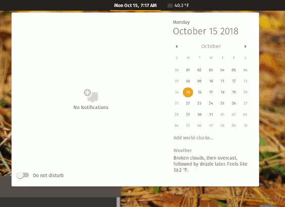
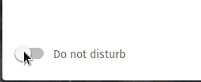

# [Do Not Disturb GNOME Shell Extension](https://github.com/kylecorry31/gnome-shell-extension-do-not-disturb)
An extension to prevent notifications from interrupting you on GNOME.



**Version 1.2.0** - [Changelog](CHANGELOG.md)

Do not disturb mode will block notifications from appearing on the screen, and will only display a dot next to the date indicating that a notification has arrived.

## Getting started
### Install
To install, use the GNOME Shell Extension web store:  https://extensions.gnome.org/extension/1480/do-not-disturb/

#### Build from sources (optional)
Clone this repo and use make to install

```shell
$ git clone https://github.com/kylecorry31/gnome-shell-extension-do-not-disturb
$ cd gnome-shell-extension-do-not-disturb
$ make install
```

The extension then must be enabled using GNOME Tweak Tool or at https://extensions.gnome.org/local/

### Usage
Once the extension is enabled, open the notification panel by clicking on the date in the top bar and click the toggle at the bottom of that panel for do not disturb. To deactive it, follow the same instructions, but toggle the do not distub off.



#### GSettings API
Enable or disable DND from the command line with the gsettings do-not-disturb flag.

```Shell
# Turn on
gsettings set org.gnome.shell.extensions.kylecorry31-do-not-disturb do-not-disturb true 

# Turn off
gsettings set org.gnome.shell.extensions.kylecorry31-do-not-disturb do-not-disturb false

# Get status
gsettings get org.gnome.shell.extensions.kylecorry31-do-not-disturb do-not-disturb 
```

**Note: you may need to set the schema dir of gsettings to the .local directory by adding this line to the commands above: `--schemadir ~/.local/share/gnome-shell/extensions/donotdisturb@kylecorry31.github.io/schemas`**

## Contributing
Please fork this repo and submit a pull request to contribute. I will review all changes and respond if they are accepted or rejected (as well as reasons, so it will be accepted). I am working with System76 to ensure this extension fits into Pop!\_OS, so some changes may not be approved or will need to be modified upon their request.

### Issues
If you are submitting a bug, please describe the bug in detail and how to replicate if possible. Logs are also very useful.

If you are submitting a feature idea, please describe it in detail and document the potential use cases of that feature if it isn't clear.

## Credits
The implementation has been done by me, and employees from System76 have added debian packaging in their fork for inclusion into Pop!\_OS. The specifications for this project came from employees of System76, check out their work at [pop-os](https://github.com/pop-os).

### Contributors
- [@kylecorry31](https://github.com/kylecorry31) - Initial work on the extension
- [@pop-os](https://github.com/pop-os) - Specifications and use cases
- [@r4dixx](https://github.com/r4dixx) - French translations

## License
You are free to copy, modify, and distribute Do Not Disturb GNOME Shell Extension with attribution under the terms of the MIT license. See the [LICENSE](LICENSE) file for details.
